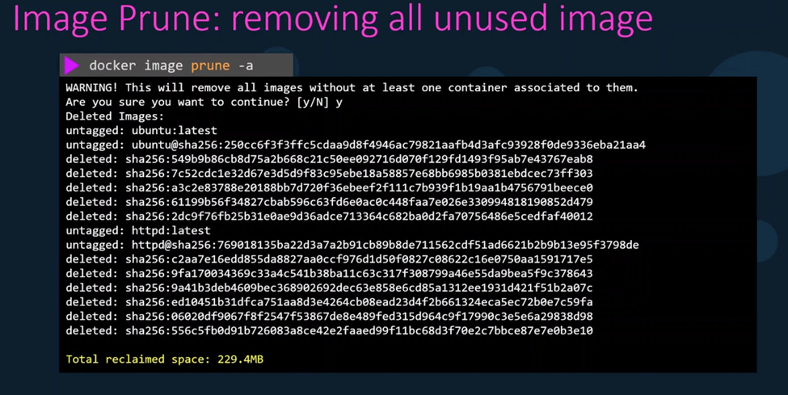
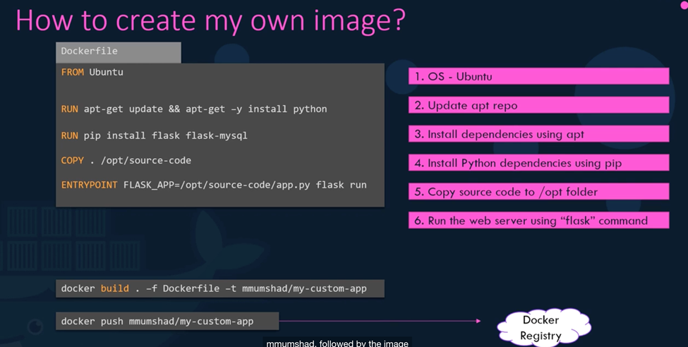
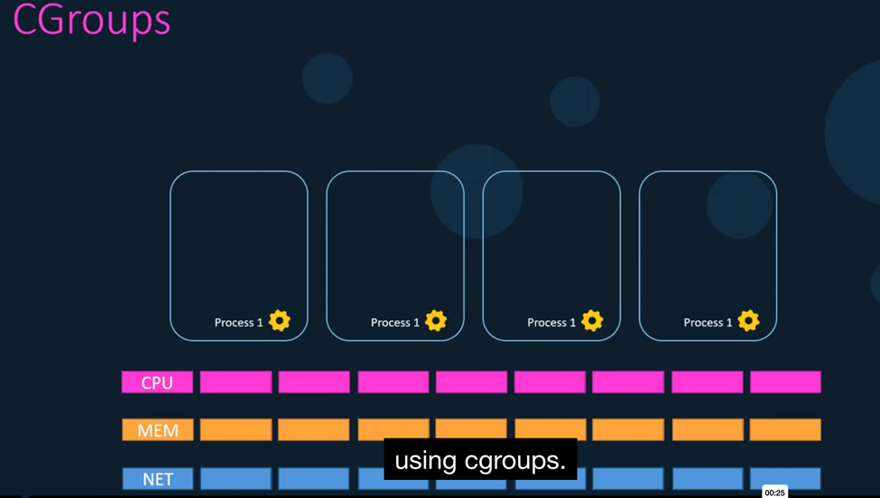

## Devops


  - Linux administration (RHCSA prefered)
  - Network basic knowledge
  - Virtualization (vmware vsphere prefered)
  - SDLC (software development life cycle) just the concept at the beginning
  - git
  - CI/CD tool (Jenkins or azure devops or github actions ...etc)
  - Docker & Docker compose
  - kubernetes
  - Ansible
  - Terraform
  - Cloud(AWS, Azure, Google, ...)
  - Monitring (Prometheus and Grafana)


## Docker

Docker is the most popular containerization technology. Containerization addresses the problem of *"It works on my machine"* by packaging an **application** with its **environment** as an image.
> Environment includes the OS setup with all the needed tools/packages installed with their specific versions.


**How it works & common commands:**

- A `Dockerfile` inclues the recipe for building an image: `docker build -t <TAG> .`
- One or more containers are instantiated from a given image: `docker run <TAG>`
- You can check running containers using `docker ps` or use docker extensions for your IDE.
- An image is typically pushed to a container registry (e.g., DockerHub): `docker login`, `docker push`
- Images can then be pulled from the registry for usage: `docker pull`

### Docker Installation

- Recommended way:

  Follow the official installation steps at <https://docs.docker.com/desktop/install/linux-install/> to install docker desktop for your distro with latest updates and supplementary tools.

- install on Centos8

  ```bash
  # Update the System
  sudo dnf update -y

  # Add Docker Repository
  sudo dnf config-manager --add-repo=https://download.docker.com/linux/centos/docker-ce.repo

  # Install Docker
  sudo dnf install docker-ce docker-ce-cli containerd.io -y

  # (Optional) Manage Docker as a Non-Root User
  sudo usermod -aG docker $USER

  # Start and Enable Docker
  sudo systemctl start docker
  sudo systemctl enable docker
  sudo systemctl status docker

  ```

### Docker Engine Architecture


- **docker cli:** for command line
- **REST API:** provide an interface to manage objects
- **Docker Daemon:** responsible for create and manage objects (images, containers, networks and volumes)
- **LXC:** the old method which use linux kernel capabilities  (Namespace amd CGroups) to manage containers
  - Namespace
  - CGroups
- **LibContainer:** writen in go language , and docker dealed with kernel directly

- **LibContainer replaced LXC:**
- **OCI:** provides some standard for creation images and containers

- **Docker Daemon:** responsible for create and manage objects (images, containers, networks and volumes)

- **RunC:** to ececute the standard of OCI so organized the tasks of containerd and runC is responsible for creation the containers

- **containerd:** for organize more so containerd manage containers then send to runC to start it then send to LibContainer to create Namespace CGroup from kernel


- **what will happen if docker is down?:** all things will be down,to fix this point the containerd-shim process is here,so if daemon is down,the containers will be running

- **docker objects:**
  - Images
  - Networks
  - Containers
  - Volumes
  

- **Registry:** is the place that hold the images (dockerhub, ECR, ...)

Docker Service Configuration
  - Docker CLI: run the command for example `docker container run -it ubuntu`
  - REST API: the command will go as API to Docker Daemon
  - Docker Daemon: will search about the image local and if not found will download from DockerHub as this is the default, then call containerd
  - Containerd: will create the container and send to container-shim
  - Container-shim: will manage the container and send to runC
  - runC: will contact with kernel for Namespace and CGroup


**Docker Service Configuration:**

```bash
systemctl start docker
systemctl stop docker
systemctl status docker

dockerd
dockerd --debug 
dockerd --debug --host=tcp://192.168.1.10:2375
```


**Basic Container Operations:**

```bash
docker container run -it ubuntu
docker image build .
docker container attach ubutu
docker container kill ubutu
docker image ls 
docker container ls 

docker container create httpd
ls /var/lib/docker
ls -ltr  /var/lib/docker/containers
ls /var/lib/docker/containers/21f4888fbe384a3e1d203a20a643edd837aa8a18dfd241818653d8af6d140349

docker container ls 
docker container ls -a
# to get last created container 
docker container ls -l
# to get the short name of running containers
docker container ls -q
# to get all
docker container ls -aq

# to start container
docker container start httpd
docker container ls

# docker run = create and start the container 
docker container run httpd

```


**Container process:** the idea for container to ececute one task and then die, so you should run continous one


**create container with name and rename it:**

```bash
docker container run -itd  --name=webapp httpd
docker container rename webapp new-webapp
```

**Interacting with a Running Container:**

```bash
docker container run -itd  --name=webapp httpd
docker container ls -l
docker container exec 1115ddd hostname 
[root@jenkins ~]# docker exec -it  2867e561c297 hostname
2867e561c297
```

**Inspecting a Container:**

```bash
docker inspect 2867e561c297
docker container stats
docker container top ubuntu

docker container logs ubuntu
docker container logs -f ubuntu

docker system events  --since 10m
```

**Stopping and Removing a Container:**

```bash
docker container run --name web httpd
docker container pause web
docker container unpause web
docker container stop web
docker container kill --signal=-9 web

# removing containers
docker container rm web
docker container ls -a
docker container ls -q
docker container stop $(docker container ls -q)
docker container rm $(docker container ls -aq)
alias boom='docker container stop $(docker container ls -q); docker container rm $(docker container ls -aq)'
docker container prune

```


**Setting a Container Hostname:**

```bash
[root@jenkins ~]# docker container run -it --name ubuntu  ubuntu
root@c946d8540af2:/# hostname
c946d8540af2

[root@jenkins ~]# docker container run -it  --name ubuntu --hostname ubuntu ubuntu
root@ubuntu:/# hostname
ubuntu
```

**Restart Policies:** you will use `--retart=(no, on-failure, always, unless stopped)`

- no: means no automatic restart
- on-failure: if exit code is 1 will restart
- always: will restart container if exit code is 0 or 1
- unless stopped: like always but if you start manual will not restart automatic

```bash
docker container run --restart=no ubuntu
docker container run --restart=on-failure ubuntu
docker container run --restart=always ubuntu
docker container run --restart=unless-stopped ubuntu
```


**Live restore:**: if you stop docker all the containers will be down so put this `"live-restore":true`in `/etc/docker/daemon.json`


**Copying Contents into Container:**

```bash
[root@jenkins docker_kodekloud]#   docker container run -itd --name ubuntu  ubuntu
be70fee232f82a224e20a8ce12497191b00a3132aed4dbc7e4c9f3687fc9ffe0
[root@jenkins docker_kodekloud]#
[root@jenkins docker_kodekloud]# docker container cp index.html ubuntu:/tmp
Successfully copied 2.05kB to ubuntu:/tmp
[root@jenkins docker_kodekloud]# docker exec -it ubuntu ls /tmp
index.html

```


**Publishing Ports:**


**Demo - Docker Container Operations Continued:**

- run and stop container
- restart Policies
- system events
- port mapping

```bash
docker container run -itd --name kodekloud --rm ubuntu
docker ps -a
docker container ls -l
docker container stop kodekloud
docker container ls -l
docker container run -itd --name kodekloud --hostname haytham_ubuntu --rm ubuntu
docker container ls -l

# restart options 
[root@jenkins docker_kodekloud]# docker container run -itd --name case_no --restart=no ubuntu
1db5c8d4d34c47a9edb03f7c343881f65991ad704e6955b6f8aab7a05501bb35
[root@jenkins docker_kodekloud]# docker ps
CONTAINER ID   IMAGE     COMMAND       CREATED         STATUS         PORTS     NAMES
1db5c8d4d34c   ubuntu    "/bin/bash"   6 seconds ago   Up 5 seconds             case_no
[root@jenkins docker_kodekloud]# docker ps -a
CONTAINER ID   IMAGE     COMMAND       CREATED          STATUS                       PORTS     NAMES
1db5c8d4d34c   ubuntu    "/bin/bash"   33 seconds ago   Exited (137) 4 seconds ago             case_no

[root@jenkins docker_kodekloud]# docker container run -itd --name case_on-failure --restart=on-failure ubuntu
f8b2c3ad210aa4dcbb5d42f49ce80e0ccacba66ee3bafc9624a807d242f976e0
[root@jenkins docker_kodekloud]# docker container top case_on-failure
UID                 PID                 PPID                C                   STIME               TTY                 TIME                CMD
root                17173               17153               0                   23:38               pts/0               00:00:00            /bin/bash
[root@jenkins docker_kodekloud]# docker ps -a
CONTAINER ID   IMAGE     COMMAND       CREATED              STATUS                            PORTS     NAMES
f8b2c3ad210a   ubuntu    "/bin/bash"   22 seconds ago       Up 21 seconds                               case_on-failure
1db5c8d4d34c   ubuntu    "/bin/bash"   About a minute ago   Exited (137) About a minute ago             case_no
[root@jenkins docker_kodekloud]# kill -p 17173
[root@jenkins docker_kodekloud]# docker ps -a
CONTAINER ID   IMAGE     COMMAND       CREATED              STATUS                            PORTS     NAMES
f8b2c3ad210a   ubuntu    "/bin/bash"   38 seconds ago       Up 3 seconds                                case_on-failure
1db5c8d4d34c   ubuntu    "/bin/bash"   About a minute ago   Exited (137) About a minute ago             case_no

[root@jenkins docker_kodekloud]# docker container run -itd --name case_always --restart=always ubuntu
b241a487f68040ed0aa8c87a8118723b971328b7013d4506234c11c9b3390cd6
[root@jenkins docker_kodekloud]#
[root@jenkins docker_kodekloud]# docker ps
CONTAINER ID   IMAGE     COMMAND       CREATED         STATUS         PORTS     NAMES
b241a487f680   ubuntu    "/bin/bash"   3 seconds ago   Up 2 seconds             case_always
[root@jenkins docker_kodekloud]#
[root@jenkins docker_kodekloud]# systemctl restart docker
[root@jenkins docker_kodekloud]#
[root@jenkins docker_kodekloud]# docker ps
CONTAINER ID   IMAGE     COMMAND       CREATED          STATUS          PORTS     NAMES
b241a487f680   ubuntu    "/bin/bash"   12 seconds ago   Up 11 seconds             case_always


[root@jenkins docker_kodekloud]#  docker container run -itd --name case_unless-stopped --restart=unless-stopped ubuntu
e2075c206feb2068afa7ad7adfafceaa1f3de16043eb39a4d645f55641dbc4da
[root@jenkins docker_kodekloud]# docker ps
CONTAINER ID   IMAGE     COMMAND       CREATED         STATUS         PORTS     NAMES
e2075c206feb   ubuntu    "/bin/bash"   4 seconds ago   Up 3 seconds             case_unless-stopped
[root@jenkins docker_kodekloud]#
[root@jenkins docker_kodekloud]# docker container stop case_unless-stopped
case_unless-stopped
[root@jenkins docker_kodekloud]#
[root@jenkins docker_kodekloud]# docker ps -a
CONTAINER ID   IMAGE     COMMAND       CREATED          STATUS                       PORTS     NAMES
e2075c206feb   ubuntu    "/bin/bash"   36 seconds ago   Exited (137) 5 seconds ago             case_unless-stopped
[root@jenkins docker_kodekloud]#
[root@jenkins docker_kodekloud]# systemctl restart docker
[root@jenkins docker_kodekloud]#
[root@jenkins docker_kodekloud]# docker ps -a
CONTAINER ID   IMAGE     COMMAND       CREATED          STATUS                        PORTS     NAMES
e2075c206feb   ubuntu    "/bin/bash"   45 seconds ago   Exited (137) 14 seconds ago             case_unless-stopped
[root@jenkins docker_kodekloud]#

# system events
[root@jenkins docker_kodekloud]# docker system events --since 10m

# copy
[root@jenkins docker_kodekloud]# docker container run -itd --name copy --rm ubuntu
3007100f08ea4fafcc2a1e3b8bfafe082f0bc881fbde3495c80fe4727291db1b
[root@jenkins docker_kodekloud]#
[root@jenkins docker_kodekloud]# docker container cp index.html copy:/tmp
Successfully copied 2.05kB to copy:/tmp
[root@jenkins docker_kodekloud]# docker exec -it copy ls /tmp
index.html
[root@jenkins docker_kodekloud]#

# port mapping
[root@jenkins docker_kodekloud]# docker container run -itd --name case01 httpd
6f20f735db3f1d88678de887eee893ea16e7e48c4f8699b16f49ee3b139d37cf
[root@jenkins docker_kodekloud]#
[root@jenkins docker_kodekloud]# docker ps -a
CONTAINER ID   IMAGE     COMMAND              CREATED         STATUS         PORTS     NAMES
6f20f735db3f   httpd     "httpd-foreground"   6 seconds ago   Up 5 seconds   80/tcp    case01
[root@jenkins docker_kodekloud]# docker container run -itd -P --name case02 httpd
[root@jenkins docker_kodekloud]# docker ps -a
CONTAINER ID   IMAGE     COMMAND              CREATED          STATUS          PORTS                                     NAMES
6354c24cb248   httpd     "httpd-foreground"   3 seconds ago    Up 2 seconds    0.0.0.0:32768->80/tcp, :::32768->80/tcp   case02
6f20f735db3f   httpd     "httpd-foreground"   37 seconds ago   Up 36 seconds   80/tcp                                    case01
[root@jenkins docker_kodekloud]# docker container run -itd -p 82:80 --name case03 httpd
1e3871a0fdb15cec74ed55fdf20b1490a9c5a11591dd74f7c5f899ca8c71b8c6
[root@jenkins docker_kodekloud]# docker ps -a
CONTAINER ID   IMAGE     COMMAND              CREATED              STATUS              PORTS                                     NAMES
1e3871a0fdb1   httpd     "httpd-foreground"   40 seconds ago       Up 38 seconds       0.0.0.0:82->80/tcp, :::82->80/tcp         case03
6354c24cb248   httpd     "httpd-foreground"   About a minute ago   Up About a minute   0.0.0.0:32768->80/tcp, :::32768->80/tcp   case02
6f20f735db3f   httpd     "httpd-foreground"   2 minutes ago        Up 2 minutes        80/tcp                                    case01
[root@jenkins docker_kodekloud]#

# here port 32768 will  be changed to other port after restart container 
[root@jenkins docker_kodekloud]# docker container restart case02
case02
[root@jenkins docker_kodekloud]# docker ps -a
CONTAINER ID   IMAGE     COMMAND              CREATED              STATUS          PORTS                                     NAMES
1e3871a0fdb1   httpd     "httpd-foreground"   55 seconds ago       Up 54 seconds   0.0.0.0:82->80/tcp, :::82->80/tcp         case03
6354c24cb248   httpd     "httpd-foreground"   About a minute ago   Up 1 second     0.0.0.0:32769->80/tcp, :::32769->80/tcp   case02
6f20f735db3f   httpd     "httpd-foreground"   2 minutes ago        Up 2 minutes    80/tcp                                    case01

# here port 82 will not be changed after restart container 
[root@jenkins docker_kodekloud]# docker container restart case03
case03
[root@jenkins docker_kodekloud]# docker ps -a
CONTAINER ID   IMAGE     COMMAND              CREATED         STATUS              PORTS                                     NAMES
1e3871a0fdb1   httpd     "httpd-foreground"   2 minutes ago   Up 2 seconds        0.0.0.0:82->80/tcp, :::82->80/tcp         case03
6354c24cb248   httpd     "httpd-foreground"   2 minutes ago   Up About a minute   0.0.0.0:32769->80/tcp, :::32769->80/tcp   case02
6f20f735db3f   httpd     "httpd-foreground"   3 minutes ago   Up 3 minutes        80/tcp                                    case01

```

**Troubleshooting Docker Daemon:**

- if you got this error


- you should understand difference between http and https

  
  

- check logs

  


- check daemon config file

  

- check free disk space on host

  

**Demo - Docker Debug Mode:**

```bash

[root@jenkins docker_kodekloud]# docker system info | grep -i Debug
 Debug Mode: false

[root@jenkins docker_kodekloud]# cat /etc/docker/daemon.json
{
  "debug": true
}

systemctl daemon-reload
```

**Loging drivers:**

```bash
[root@jenkins docker_kodekloud]# docker run -d --name nginx nginx
[root@jenkins docker_kodekloud]# docker logs nginx
[root@jenkins docker_kodekloud]# docker system info | grep -i logg
 Logging Driver: json-file

[root@jenkins docker_kodekloud]# cd /var/lib/docker/containers/; ls
5cf5d10c6abb0f8f79cb3469a0b9571f3f8aadd1c60056e26af523efc14e06d7
[root@jenkins containers]# cat 5cf5d10c6abb0f8f79cb3469a0b9571f3f8aadd1c60056e26af523efc14e06d7/5cf5d10c6abb0f8f79cb3469a0b9571f3f8aadd1c60056e26af523efc14e06d7-json.log

```


- if you want to change to aws logs


- log drivers options


**Docker Image Registry:**

```bash
docker run ubuntu
docker run ubuntu:latest
docker run ubuntu:18.04
docker run ubuntu:trusty

docker images ls

docker search httpd
docker search httpd --limit 2
docker search --filter stars=10 httpd 

docker image pull httpd
docker image list 
```

**Image Addressing Convention:**


**Authenticating to Registries:**


**Removing a Docker Image:**




**Inspecting a Docker Image:**


**Save and Load Images:**


**Demo - Image Registry and Operations:**

```bash
[root@jenkins containers]# docker search httpd
NAME                     DESCRIPTION                                     STARS     OFFICIAL
httpd                    The Apache HTTP Server Project                  4841      [OK]
manageiq/httpd           Container with httpd, built on CentOS for Ma…   1
paketobuildpacks/httpd                                                   0
vulhub/httpd                                                             0
openquantumsafe/httpd    Demo of post-quantum cryptography in Apache …   17
openeuler/httpd                                                          0
dockerpinata/httpd                                                       1
e2eteam/httpd                                                            0
manasip/httpd                                                            0
centos/httpd                                                             36

[root@jenkins containers]# docker search httpd --limit 3
NAME                     DESCRIPTION                                     STARS     OFFICIAL
httpd                    The Apache HTTP Server Project                  4841      [OK]
manageiq/httpd           Container with httpd, built on CentOS for Ma…   1
paketobuildpacks/httpd                                                   0


[root@jenkins containers]# docker search --filter stars=10 httpd
NAME                    DESCRIPTION                                     STARS     OFFICIAL
httpd                   The Apache HTTP Server Project                  4841      [OK]
openquantumsafe/httpd   Demo of post-quantum cryptography in Apache …   17
centos/httpd                                                            36
arm32v7/httpd           The Apache HTTP Server Project                  11
arm64v8/httpd           The Apache HTTP Server Project                  11

[root@jenkins containers]# docker search --filter  is-official=true httpd
NAME      DESCRIPTION                      STARS     OFFICIAL
httpd     The Apache HTTP Server Project   4841      [OK]

docker pull httpd
docker pull httpd:alpine

# tag
docker tag httpd:apline httpd:kodekloudv1

# check size of images
docker system df

# tag and push
[root@jenkins containers]# docker tag ubuntu:latest haytham1992/java-maven:ubuntu
[root@jenkins containers]# docker push haytham1992/java-maven:ubuntu

# rm
docker rm httpd:alpine

# save and load
[root@jenkins containers]# docker image save httpd:latest -o haytham.tar
[root@jenkins containers]# docker image load -i haytham.tar

# to get layers
[root@jenkins containers]# docker image history ubuntu:latest
IMAGE          CREATED       CREATED BY                                      SIZE      COMMENT
a04dc4851cbc   5 weeks ago   /bin/sh -c #(nop)  CMD ["/bin/bash"]            0B
<missing>      5 weeks ago   /bin/sh -c #(nop) ADD file:6df775300d76441aa…   78.1MB
<missing>      5 weeks ago   /bin/sh -c #(nop)  LABEL org.opencontainers.…   0B
<missing>      5 weeks ago   /bin/sh -c #(nop)  LABEL org.opencontainers.…   0B
<missing>      5 weeks ago   /bin/sh -c #(nop)  ARG LAUNCHPAD_BUILD_ARCH     0B
<missing>      5 weeks ago   /bin/sh -c #(nop)  ARG RELEASE                  0B

# export from container to image then import
[root@jenkins containers]# docker run -d --name nginx nginx
a284951e77bfb10d792373fd583d33a113f8454499fe20b8d3cc2693598bd9d7
[root@jenkins containers]#
[root@jenkins containers]# docker ps
CONTAINER ID   IMAGE     COMMAND                  CREATED          STATUS          PORTS     NAMES
a284951e77bf   nginx     "/docker-entrypoint.…"   13 seconds ago   Up 12 seconds   80/tcp    nginx
[root@jenkins containers]# docker  export nginx > haytham.tar
[root@jenkins containers]# ls
haytham.tar
[root@jenkins containers]# docker image import haytham.tar haytham:latest
sha256:9cca021d25fdee6299c48c8d7859eebde40d9e28f8f4da5faf80b1ec5502ec03
[root@jenkins containers]# docker images | grep -i hay
haytham                          latest             9cca021d25fd   12 seconds ago   190MB

```

**Building a custom image:**




**Demo - Build HTTPD image:**

```bash
mkdir httpd_project ; cd mkdir httpd_project
[root@jenkins httpd_project]# echo "<h1>Hello from Dockerfile </h1>" > index.html


[root@jenkins httpd_project]# cat > Dockerfile
FROM centos:7

# Fix repository URLs
RUN sed -i 's/mirrorlist/#mirrorlist/g' /etc/yum.repos.d/CentOS-*.repo && \
    sed -i 's|#baseurl=http://mirror.centos.org|baseurl=http://vault.centos.org|g' /etc/yum.repos.d/CentOS-*.repo

# Update and install httpd
RUN yum -y update && \
    yum -y install httpd

# Copy custom index.html
COPY ./index.html /var/www/html/index.html

# Expose port 80
EXPOSE 80

# Start httpd service
CMD ["httpd", "-D", "FOREGROUND"]

[root@jenkins httpd_project]# docker image history haytham1992/test_httpd:v1
IMAGE          CREATED          CREATED BY                                      SIZE      COMMENT
bbeaa72995f0   52 seconds ago   CMD ["httpd" "-D" "FOREGROUND"]                 0B        buildkit.dockerfile.v0
<missing>      52 seconds ago   EXPOSE map[80/tcp:{}]                           0B        buildkit.dockerfile.v0
<missing>      52 seconds ago   COPY ./index.html /var/www/html/index.html #…   32B       buildkit.dockerfile.v0
<missing>      52 seconds ago   RUN /bin/sh -c yum -y update &&     yum -y i…   428MB     buildkit.dockerfile.v0
<missing>      2 minutes ago    RUN /bin/sh -c sed -i 's/mirrorlist/#mirrorl…   15kB      buildkit.dockerfile.v0
<missing>      3 years ago      /bin/sh -c #(nop)  CMD ["/bin/bash"]            0B
<missing>      3 years ago      /bin/sh -c #(nop)  LABEL org.label-schema.sc…   0B
<missing>      3 years ago      /bin/sh -c #(nop) ADD file:b3ebbe8bd304723d4…   204MB


[root@jenkins httpd_project]# docker run -itd --name haytham -p 82:80 haytham1992/test_httpd:v1
[root@jenkins httpd_project]# docker push haytham1992/test_httpd:v1

```

**Demo - Build Tomcat image:**

```bash
git clone https://github.com/yogeshraheja/dockertomcat.git
cd dockertomcat/

[root@jenkins dockertomcat]# cat Dockerfile
FROM centos:7
# Fix repository URLs
RUN sed -i 's/mirrorlist/#mirrorlist/g' /etc/yum.repos.d/CentOS-*.repo && \
    sed -i 's|#baseurl=http://mirror.centos.org|baseurl=http://vault.centos.org|g' /etc/yum.repos.d/CentOS-*.repo
ARG tomcat_version=8.5.6
RUN  yum install -y epel-release java-1.8.0-openjdk.x86_64 wget
RUN groupadd tomcat && mkdir /opt/tomcat
RUN useradd -s /bin/nologin -g tomcat -d /opt/tomcat tomcat
WORKDIR /
RUN wget https://archive.apache.org/dist/tomcat/tomcat-8/v$tomcat_version/bin/apache-tomcat-$tomcat_version.tar.gz
RUN tar -zxvf apache-tomcat-$tomcat_version.tar.gz -C /opt/tomcat --strip-components=1
RUN cd /opt/tomcat && chgrp -R tomcat conf
RUN chmod g+rwx /opt/tomcat/conf && chmod g+r /opt/tomcat/conf/*
RUN chown -R tomcat /opt/tomcat/logs/ /opt/tomcat/temp /opt/tomcat/webapps /opt/tomcat/work
RUN chgrp -R tomcat /opt/tomcat/bin && chgrp -R tomcat /opt/tomcat/lib && chmod g+rwx /opt/tomcat/bin && chmod g+r /opt/tomcat/bin/*
WORKDIR /opt/tomcat/webapps
RUN wget https://tomcat.apache.org/tomcat-7.0-doc/appdev/sample/sample.war
EXPOSE 8080
CMD ["/opt/tomcat/bin/catalina.sh","run"]

docker build -t haytham1992/test_tomcat:v1 .
docker run -itd --name haytham_tomcat_v1 -p 85:8080 haytham1992/test_tomcat:v1

docker build -t haytham1992/test_tomcat:v2 --build-arg tomcat_version=8.5.8 .
docker run -itd --name haytham_tomcat_v2 -p 90:8080 haytham1992/test_tomcat:v2

```

**Docker commit method:**


**Demo - Image Creation Docker Commit Method:**

```bash
[root@jenkins dockertomcat]# docker pull  centos:7
[root@jenkins dockertomcat]# docker container create -it --name centos7 centos:7
[root@jenkins dockertomcat]# docker container start centos7
[root@jenkins dockertomcat]# docker exec -it centos7 /bin/bash
[root@8f660e078173 /]# sed -i 's/mirrorlist/#mirrorlist/g' /etc/yum.repos.d/CentOS-*.repo 
[root@8f660e078173 /]# sed -i 's|#baseurl=http://mirror.centos.org|baseurl=http://vault.centos.org|g' etc/yum.repos.d/CentOS-*.repo
[root@8f660e078173 /]# yum install -y httpd
[root@8f660e078173 /]# echo "hello from kodekloud" > /var/www/html/index.html
[root@8f660e078173 /]# exit 

[root@jenkins dockertomcat]# docker container stop centos7
centos7
# -a ==> author and -c ==> the commad for docker file , centos7 ==> is the name of container centos7_from_commit_conatiner:v1 => the new image name 
[root@jenkins dockertomcat]# docker container commit -a "Haytham Awadallah" -c 'CMD ["httpd","-D","FOREGROUND"]' centos7 centos7_from_commit_conatiner:v1
sha256:6c8d949c009536c157e7179a62e74eab3a365e6ad4e8b35335c84f90fbffd4b3
[root@jenkins dockertomcat]# docker container run -itd --name commit-container -p 80:80 centos7_from_commit_conatiner:v1
13a951f178834ab3a55f1a2f1c48a52bc243989fbd1577a2c9b80cde0e11fcd6
[root@jenkins dockertomcat]#

[root@jenkins dockertomcat]# docker tag centos7_from_commit_conatiner:v1 haytham1992/centos7_from_commit_conatiner:v1
[root@jenkins dockertomcat]# docker push haytham1992/centos7_from_commit_conatiner:v1

```

**Build Contexts:**


**Build Cache:**


**COPY vs ADD:**

 - Best practice is to use COPY not ADD why? as copy save layers than add 


**CMD vs Entrypoint:**


**Base vs Parent Image:**


**Multi-Stage Builds:**


**Dockerfile - Best Practices:**


**Docker Daemon Security:**


**Namespaces and Capabilities:**


**CGroups:**




**Resource Limits Memory:**


**Demo - Resource Limits:**


**Docker Network:**

**Docker Storage:**

**Docker Compose:**

## Resources

- kodeKloud: <https://learn.kodekloud.com/user/courses/docker-certified-associate-exam-course>
