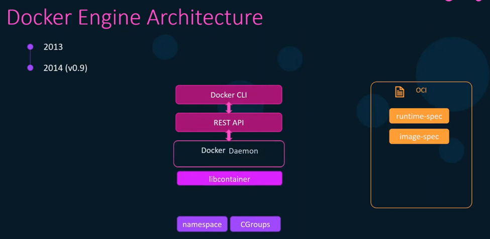
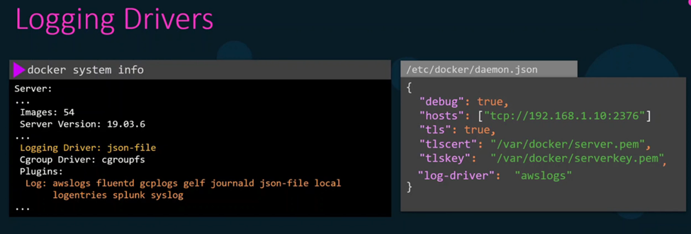

## Docker

Docker is the most popular containerization technology. Containerization addresses the problem of *"It works on my machine"* by packaging an **application** with its **environment** as an image.
> Environment includes the OS setup with all the needed tools/packages installed with their specific versions.


**How it works & common commands:**

- A `Dockerfile` inclues the recipe for building an image: `docker build -t <TAG> .`
- One or more containers are instantiated from a given image: `docker run <TAG>`
- You can check running containers using `docker ps` or use docker extensions for your IDE.
- An image is typically pushed to a container registry (e.g., DockerHub): `docker login`, `docker push`
- Images can then be pulled from the registry for usage: `docker pull`

### Docker Installation

- Recommended way:

  Follow the official installation steps at <https://docs.docker.com/desktop/install/linux-install/> to install docker desktop for your distro with latest updates and supplementary tools.

- install on Centos8

  ```bash
  # Update the System
  sudo dnf update -y

  # Add Docker Repository
  sudo dnf config-manager --add-repo=https://download.docker.com/linux/centos/docker-ce.repo

  # Install Docker
  sudo dnf install docker-ce docker-ce-cli containerd.io -y

  # (Optional) Manage Docker as a Non-Root User
  sudo usermod -aG docker $USER

  # Start and Enable Docker
  sudo systemctl start docker
  sudo systemctl enable docker
  sudo systemctl status docker

  ```


### Docker Engine Architecture


- **docker cli:** for command line
- **REST API:** provide an interface to manage objects
- **Docker Daemon:** responsible for create and manage objects (images, containers, networks and volumes)
- **LXC:** the old method which use linux kernel capabilities  (Namespace amd CGroups) to manage containers
  - Namespace
  - CGroups
- **LibContainer:** writen in go language , and docker dealed with kernel directly

- **LibContainer replaced LXC:** 
- **OCI:** provides some standard for creation images and containers

- **Docker Daemon:** responsible for create and manage objects (images, containers, networks and volumes)

- **RunC:** to ececute the standard of OCI so organized the tasks of containerd and runC is responsible for creation the containers

- **containerd:** for organize more so containerd manage containers then send to runC to start it then send to LibContainer to create Namespace CGroup from kernel


- **what will happen if docker is down?:** all things will be down,to fix this point the containerd-shim process is here,so if daemon is down,the containers will be running

- **docker objects:** 
  - Images
  - Networks
  - Containers
  - Volumes 

- **Registry:** is the place that hold the images (dockerhub, ECR, ...)

Docker Service Configuration
  - Docker CLI: run the command for example `docker container run -it ubuntu`
  - REST API: the command will go as API to Docker Daemon
  - Docker Daemon: will search about the image local and if not found will download from DockerHub as this is the default, then call containerd
  - Containerd: will create the container and send to container-shim 
  - Container-shim: will manage the container and send to runC
  - runC: will contact with kernel for Namespace and CGroup 


**Docker Service Configuration:**
```bash
systemctl start docker
systemctl stop docker
systemctl status docker

dockerd
dockerd --debug 
dockerd --debug --host=tcp://192.168.1.10:2375
```


**Basic Container Operations:**
```bash
docker container run -it ubuntu
docker image build .
docker container attach ubutu
docker container kill ubutu
docker image ls 
docker container ls 

docker container create httpd
ls /var/lib/docker
ls -ltr  /var/lib/docker/containers
ls /var/lib/docker/containers/21f4888fbe384a3e1d203a20a643edd837aa8a18dfd241818653d8af6d140349

docker container ls 
docker container ls -a
# to get last created container 
docker container ls -l
# to get the short name of running containers
docker container ls -q
# to get all
docker container ls -aq

# to start container
docker container start httpd
docker container ls

# docker run = create and start the container 
docker container run httpd

```


**Container process:** the idea for container to ececute one task and then die, so you should run continous one 


**create container with name and rename it:**
```bash
docker container run -itd  --name=webapp httpd
docker container rename webapp new-webapp
```


**Interacting with a Running Container:**
```bash
docker container run -itd  --name=webapp httpd
docker container ls -l
docker container exec 1115ddd hostname 
[root@jenkins ~]# docker exec -it  2867e561c297 hostname
2867e561c297
```

**Inspecting a Container:**
```bash
docker inspect 2867e561c297
docker container stats
docker container top ubuntu

docker container logs ubuntu
docker container logs -f ubuntu

docker system events  --since 10m
```

**Stopping and Removing a Container:**
```bash
docker container run --name web httpd
docker container pause web
docker container unpause web
docker container stop web
docker container kill --signal=-9 web

# removing containers
docker container rm web
docker container ls -a
docker container ls -q
docker container stop $(docker container ls -q)
docker container rm $(docker container ls -aq)
alias boom='docker container stop $(docker container ls -q); docker container rm $(docker container ls -aq)'
docker container prune

```


**Setting a Container Hostname:**
```bash
[root@jenkins ~]# docker container run -it --name ubuntu  ubuntu
root@c946d8540af2:/# hostname
c946d8540af2

[root@jenkins ~]# docker container run -it  --name ubuntu --hostname ubuntu ubuntu
root@ubuntu:/# hostname
ubuntu
```

**Restart Policies:** you will use `--retart=(no, on-failure, always, unless stopped)`
  - no: means no automatic restart 
  - on-failure: if exit code is 1 will restart 
  - always: will restart container if exit code is 0 or 1 
  - unless stopped: like always but if you start manual will not restart automatic
```bash
docker container run --restart=no ubuntu
docker container run --restart=on-failure ubuntu
docker container run --restart=always ubuntu
docker container run --restart=unless-stopped ubuntu
```


**Live restore:**: if you stop docker all the containers will be down so put this `"live-restore":true`in `/etc/docker/daemon.json` 


**Copying Contents into Container:** 
```bash
[root@jenkins docker_kodekloud]#   docker container run -itd --name ubuntu  ubuntu
be70fee232f82a224e20a8ce12497191b00a3132aed4dbc7e4c9f3687fc9ffe0
[root@jenkins docker_kodekloud]#
[root@jenkins docker_kodekloud]# docker container cp index.html ubuntu:/tmp
Successfully copied 2.05kB to ubuntu:/tmp
[root@jenkins docker_kodekloud]# docker exec -it ubuntu ls /tmp
index.html

```


**Publishing Ports:** 


**Demo - Docker Container Operations Continued:** 
  - run and stop container
  - restart Policies
  - system events 
  - port mapping 
```bash
docker container run -itd --name kodekloud --rm ubuntu
docker ps -a
docker container ls -l
docker container stop kodekloud
docker container ls -l
docker container run -itd --name kodekloud --hostname haytham_ubuntu --rm ubuntu
docker container ls -l

# restart options 
[root@jenkins docker_kodekloud]# docker container run -itd --name case_no --restart=no ubuntu
1db5c8d4d34c47a9edb03f7c343881f65991ad704e6955b6f8aab7a05501bb35
[root@jenkins docker_kodekloud]# docker ps
CONTAINER ID   IMAGE     COMMAND       CREATED         STATUS         PORTS     NAMES
1db5c8d4d34c   ubuntu    "/bin/bash"   6 seconds ago   Up 5 seconds             case_no
[root@jenkins docker_kodekloud]# docker ps -a
CONTAINER ID   IMAGE     COMMAND       CREATED          STATUS                       PORTS     NAMES
1db5c8d4d34c   ubuntu    "/bin/bash"   33 seconds ago   Exited (137) 4 seconds ago             case_no

[root@jenkins docker_kodekloud]# docker container run -itd --name case_on-failure --restart=on-failure ubuntu
f8b2c3ad210aa4dcbb5d42f49ce80e0ccacba66ee3bafc9624a807d242f976e0
[root@jenkins docker_kodekloud]# docker container top case_on-failure
UID                 PID                 PPID                C                   STIME               TTY                 TIME                CMD
root                17173               17153               0                   23:38               pts/0               00:00:00            /bin/bash
[root@jenkins docker_kodekloud]# docker ps -a
CONTAINER ID   IMAGE     COMMAND       CREATED              STATUS                            PORTS     NAMES
f8b2c3ad210a   ubuntu    "/bin/bash"   22 seconds ago       Up 21 seconds                               case_on-failure
1db5c8d4d34c   ubuntu    "/bin/bash"   About a minute ago   Exited (137) About a minute ago             case_no
[root@jenkins docker_kodekloud]# kill -p 17173
[root@jenkins docker_kodekloud]# docker ps -a
CONTAINER ID   IMAGE     COMMAND       CREATED              STATUS                            PORTS     NAMES
f8b2c3ad210a   ubuntu    "/bin/bash"   38 seconds ago       Up 3 seconds                                case_on-failure
1db5c8d4d34c   ubuntu    "/bin/bash"   About a minute ago   Exited (137) About a minute ago             case_no

[root@jenkins docker_kodekloud]# docker container run -itd --name case_always --restart=always ubuntu
b241a487f68040ed0aa8c87a8118723b971328b7013d4506234c11c9b3390cd6
[root@jenkins docker_kodekloud]#
[root@jenkins docker_kodekloud]# docker ps
CONTAINER ID   IMAGE     COMMAND       CREATED         STATUS         PORTS     NAMES
b241a487f680   ubuntu    "/bin/bash"   3 seconds ago   Up 2 seconds             case_always
[root@jenkins docker_kodekloud]#
[root@jenkins docker_kodekloud]# systemctl restart docker
[root@jenkins docker_kodekloud]#
[root@jenkins docker_kodekloud]# docker ps
CONTAINER ID   IMAGE     COMMAND       CREATED          STATUS          PORTS     NAMES
b241a487f680   ubuntu    "/bin/bash"   12 seconds ago   Up 11 seconds             case_always


[root@jenkins docker_kodekloud]#  docker container run -itd --name case_unless-stopped --restart=unless-stopped ubuntu
e2075c206feb2068afa7ad7adfafceaa1f3de16043eb39a4d645f55641dbc4da
[root@jenkins docker_kodekloud]# docker ps
CONTAINER ID   IMAGE     COMMAND       CREATED         STATUS         PORTS     NAMES
e2075c206feb   ubuntu    "/bin/bash"   4 seconds ago   Up 3 seconds             case_unless-stopped
[root@jenkins docker_kodekloud]#
[root@jenkins docker_kodekloud]# docker container stop case_unless-stopped
case_unless-stopped
[root@jenkins docker_kodekloud]#
[root@jenkins docker_kodekloud]# docker ps -a
CONTAINER ID   IMAGE     COMMAND       CREATED          STATUS                       PORTS     NAMES
e2075c206feb   ubuntu    "/bin/bash"   36 seconds ago   Exited (137) 5 seconds ago             case_unless-stopped
[root@jenkins docker_kodekloud]#
[root@jenkins docker_kodekloud]# systemctl restart docker
[root@jenkins docker_kodekloud]#
[root@jenkins docker_kodekloud]# docker ps -a
CONTAINER ID   IMAGE     COMMAND       CREATED          STATUS                        PORTS     NAMES
e2075c206feb   ubuntu    "/bin/bash"   45 seconds ago   Exited (137) 14 seconds ago             case_unless-stopped
[root@jenkins docker_kodekloud]#

# system events
[root@jenkins docker_kodekloud]# docker system events --since 10m

# copy
[root@jenkins docker_kodekloud]# docker container run -itd --name copy --rm ubuntu
3007100f08ea4fafcc2a1e3b8bfafe082f0bc881fbde3495c80fe4727291db1b
[root@jenkins docker_kodekloud]#
[root@jenkins docker_kodekloud]# docker container cp index.html copy:/tmp
Successfully copied 2.05kB to copy:/tmp
[root@jenkins docker_kodekloud]# docker exec -it copy ls /tmp
index.html
[root@jenkins docker_kodekloud]#

# port mapping
[root@jenkins docker_kodekloud]# docker container run -itd --name case01 httpd
6f20f735db3f1d88678de887eee893ea16e7e48c4f8699b16f49ee3b139d37cf
[root@jenkins docker_kodekloud]#
[root@jenkins docker_kodekloud]# docker ps -a
CONTAINER ID   IMAGE     COMMAND              CREATED         STATUS         PORTS     NAMES
6f20f735db3f   httpd     "httpd-foreground"   6 seconds ago   Up 5 seconds   80/tcp    case01
[root@jenkins docker_kodekloud]# docker container run -itd -P --name case02 httpd
[root@jenkins docker_kodekloud]# docker ps -a
CONTAINER ID   IMAGE     COMMAND              CREATED          STATUS          PORTS                                     NAMES
6354c24cb248   httpd     "httpd-foreground"   3 seconds ago    Up 2 seconds    0.0.0.0:32768->80/tcp, :::32768->80/tcp   case02
6f20f735db3f   httpd     "httpd-foreground"   37 seconds ago   Up 36 seconds   80/tcp                                    case01
[root@jenkins docker_kodekloud]# docker container run -itd -p 82:80 --name case03 httpd
1e3871a0fdb15cec74ed55fdf20b1490a9c5a11591dd74f7c5f899ca8c71b8c6
[root@jenkins docker_kodekloud]# docker ps -a
CONTAINER ID   IMAGE     COMMAND              CREATED              STATUS              PORTS                                     NAMES
1e3871a0fdb1   httpd     "httpd-foreground"   40 seconds ago       Up 38 seconds       0.0.0.0:82->80/tcp, :::82->80/tcp         case03
6354c24cb248   httpd     "httpd-foreground"   About a minute ago   Up About a minute   0.0.0.0:32768->80/tcp, :::32768->80/tcp   case02
6f20f735db3f   httpd     "httpd-foreground"   2 minutes ago        Up 2 minutes        80/tcp                                    case01
[root@jenkins docker_kodekloud]#

# here port 32768 will  be changed to other port after restart container 
[root@jenkins docker_kodekloud]# docker container restart case02
case02
[root@jenkins docker_kodekloud]# docker ps -a
CONTAINER ID   IMAGE     COMMAND              CREATED              STATUS          PORTS                                     NAMES
1e3871a0fdb1   httpd     "httpd-foreground"   55 seconds ago       Up 54 seconds   0.0.0.0:82->80/tcp, :::82->80/tcp         case03
6354c24cb248   httpd     "httpd-foreground"   About a minute ago   Up 1 second     0.0.0.0:32769->80/tcp, :::32769->80/tcp   case02
6f20f735db3f   httpd     "httpd-foreground"   2 minutes ago        Up 2 minutes    80/tcp                                    case01

# here port 82 will not be changed after restart container 
[root@jenkins docker_kodekloud]# docker container restart case03
case03
[root@jenkins docker_kodekloud]# docker ps -a
CONTAINER ID   IMAGE     COMMAND              CREATED         STATUS              PORTS                                     NAMES
1e3871a0fdb1   httpd     "httpd-foreground"   2 minutes ago   Up 2 seconds        0.0.0.0:82->80/tcp, :::82->80/tcp         case03
6354c24cb248   httpd     "httpd-foreground"   2 minutes ago   Up About a minute   0.0.0.0:32769->80/tcp, :::32769->80/tcp   case02
6f20f735db3f   httpd     "httpd-foreground"   3 minutes ago   Up 3 minutes        80/tcp                                    case01

```

**Troubleshooting Docker Daemon:** 
- if you got this error


  - you should understand difference between http and https 

  
  
  - check logs

  

  - check daemon config file 

  
  - check free disk space on host 

  


**Demo - Docker Debug Mode:** 
```bash

[root@jenkins docker_kodekloud]# docker system info | grep -i Debug
 Debug Mode: false

[root@jenkins docker_kodekloud]# cat /etc/docker/daemon.json
{
  "debug": true
}

systemctl daemon-reload
```

**Loging drivers:** 
```bash
[root@jenkins docker_kodekloud]# docker run -d --name nginx nginx
[root@jenkins docker_kodekloud]# docker logs nginx
[root@jenkins docker_kodekloud]# docker system info | grep -i logg
 Logging Driver: json-file

[root@jenkins docker_kodekloud]# cd /var/lib/docker/containers/; ls
5cf5d10c6abb0f8f79cb3469a0b9571f3f8aadd1c60056e26af523efc14e06d7
[root@jenkins containers]# cat 5cf5d10c6abb0f8f79cb3469a0b9571f3f8aadd1c60056e26af523efc14e06d7/5cf5d10c6abb0f8f79cb3469a0b9571f3f8aadd1c60056e26af523efc14e06d7-json.log

```


- if you want to change to aws logs 


- log drivers options


## Resources

- kodeKloud: https://learn.kodekloud.com/user/courses/docker-certified-associate-exam-course